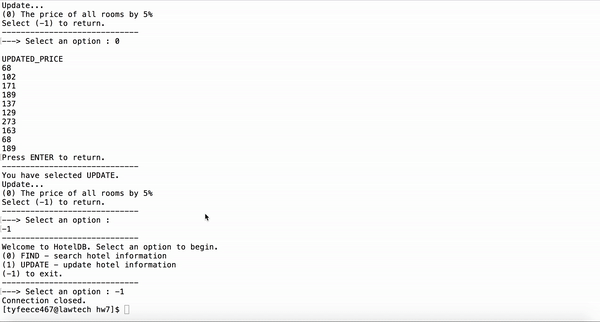

# Hotel Database
 \
A higher resolution demo video is here, https://youtu.be/gsWx_b-uqyE. \
[](http://www.youtube.com/watch?v=gsWx_b-uqyE)
\
\
This is a database of different hotels, rooms, guests, and booking information implemented using embedded SQL in Java. \
Users can query the database and update information through the command line interface. \
\
To run this, download all of the following files to the same directory: 
```
Main.java
QueryManager.java
Menu.java
UI.java
Makefile
```
Use the SQL commands in `createtable.sql` to create tables in your database, and then insert valid tuples of your liking into each of the four tables. \
Then type `make run` in your terminal (in the directory where all the `.java` files are located) to run the program.\
It should pop up a menu that you can use to select which SQL command you want to run. \
\
As a side note, I used Oracle database via JDBC API. 
